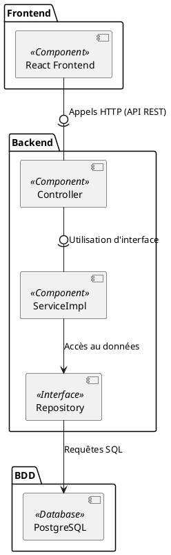

# Documentation du Diagramme de Composants

## Objectif
Le diagramme de composants illustre l'architecture des différents composants de notre système, en mettant en évidence leurs interactions, dépendances et responsabilités.

Cela permet de visualiser la structure de notre application et de garantir la séparation des préoccupations, l'évolutivité et la maintenabilité.

---

## 1. Composants Principaux

- **API REST Service** :
    - Le composant principal qui expose les endpoints via une API REST (Spring Boot).
    - Il reçoit et traite les demandes des utilisateurs, interagissant avec les services métiers.

- **Service Métiers** :
    - Regroupe les différentes règles métier appliquées aux données.
    - Fournit des services spécifiques utilisés par l'API REST pour la logique d'affaires.

- **Repository** :
    - Interface pour accéder à la base de données.
    - Permet à l'API REST de lire et écrire des données, en utilisant des abstractions Spring Data JPA.

- **Front-End Application** :
    - Le client de l'application qui s'exécute dans le navigateur des utilisateurs.
    - Fait des appels HTTP à l'API REST pour récupérer et afficher les données.

- **Base de Données PostgeSQL** :
    - Le stockage persistant des données de l'application, utilisé par les composants backend pour stocker et récupérer des informations.

---

## 2. Diagramme de Composants

Le diagramme ci-dessous illustre la structure de ces composants et leurs interactions :

---

Cette approche suit les meilleures pratiques pour garantir la cohérence, la modularité et la maintenabilité du système.
