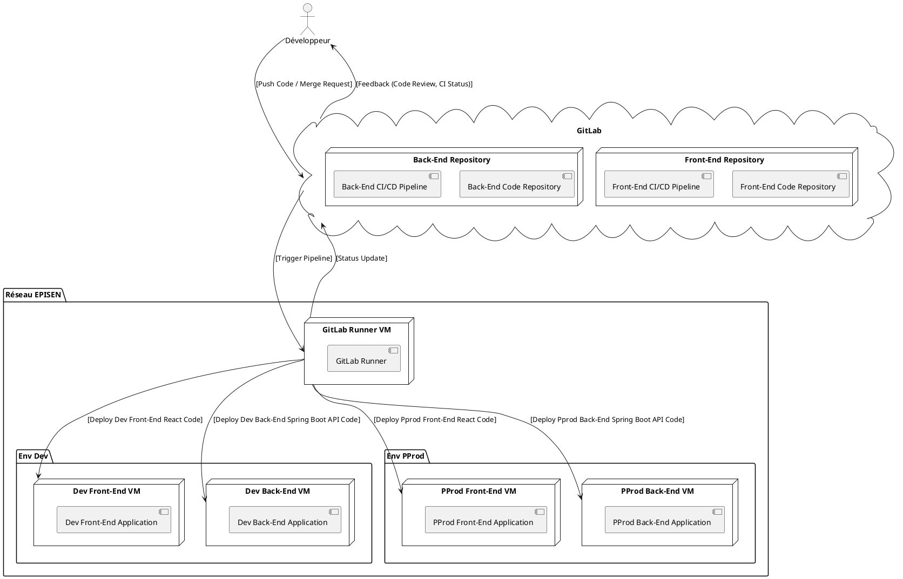
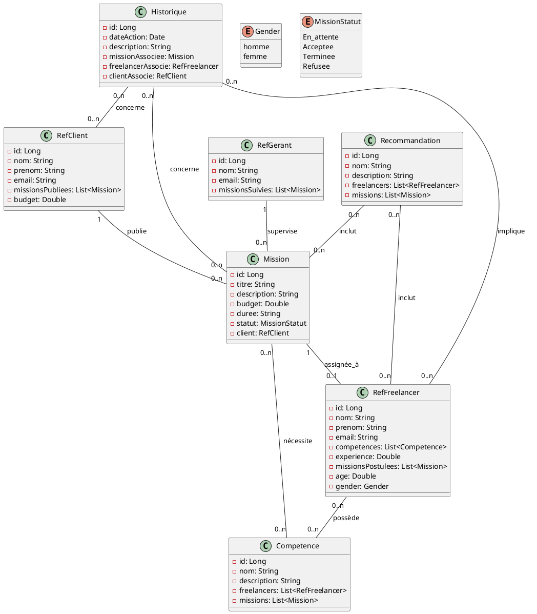

# Documentation du Diagramme de Déploiement

## Objectif
Ce diagramme représente le processus complet de déploiement de notre application.

---

## 1. Acteurs et Composants

- **Développeur** :
    - L'utilisateur qui écrit, pousse et gère le code source.
    - Rôles principaux : création de **Merge Requests**, revue de code, suivi des pipelines CI/CD.

- **GitLab** :
    - Contient les dépôts de code front-end et back-end.
    - Fournit des fonctionnalités CI/CD pour orchestrer les pipelines de build, test et déploiement.
    - Envoie des notifications sur l'état des pipelines et les résultats des revues de code.

- **GitLab Runner** :
    - Un service indépendant exécutant les tâches CI/CD définies dans GitLab.
    - Effectue les déploiements dans les environnements front-end et back-end.

- **Front-End VM** :
    - Héberge l'application web front-end développée en React.
    - Accessible via HTTP/HTTPS par les utilisateurs.

- **Back-End VM** :
    - Héberge l'API REST Spring Boot, qui est le back-end de l'application.
    - Communique avec le front-end et la base de données.

---

## 2. Flux du Déploiement

1. **Contribution du Développeur** :
    - **Action** : Le développeur pousse du code ou crée une Merge Request dans GitLab (front-end ou back-end).
    - **Retour** : GitLab fournit un retour d'information via des revues de code ou des résultats de pipelines (succès, échec).

2. **Pipeline CI/CD** :
    - GitLab déclenche les pipelines CI/CD après un événement (commit/push, Merge Request).
    - Les tâches sont exécutées par le **GitLab Runner** :
        - Build des artefacts (front-end et/ou back-end).
        - Tests automatiques pour garantir la qualité du code.
        - Déploiement dans les environnements cibles.

3. **Déploiement Automatisé** :
    - **Front-End** : Les artefacts front-end (React) sont déployés sur la **Front-End VM**.
    - **Back-End** : Les artefacts back-end (Spring Boot) sont déployés sur la **API REST VM**.
    - Les mises à jour des pipelines sont synchronisées avec GitLab pour informer les développeurs.

---

## 3. Meilleures Pratiques Implémentées

1. **Séparation des responsabilités** :
    - Dépôts distincts pour le front-end et le back-end.
    - Pipelines indépendants pour permettre une gestion modulaire des déploiements.

2. **Automatisation** :
    - Utilisation de GitLab Runner pour minimiser les interventions manuelles.
    - Les builds, tests et déploiements sont gérés automatiquement via CI/CD.

3. **Retour d'information rapide** :
    - GitLab notifie les développeurs des résultats des pipelines en temps réel.
    - Les statuts de build, tests et déploiements sont facilement accessibles.

4. **Environnements isolés** :
    - Chaque composant (front-end, back-end, base de données) est hébergé sur des machines virtuelles séparées pour des raisons de sécurité et de maintenance.

---

## 4. Diagramme de Déploiement

---

Cette documentation présente un processus de déploiement conforme aux meilleures pratiques, combinant modularité, automatisation et retour rapide pour les développeurs.
