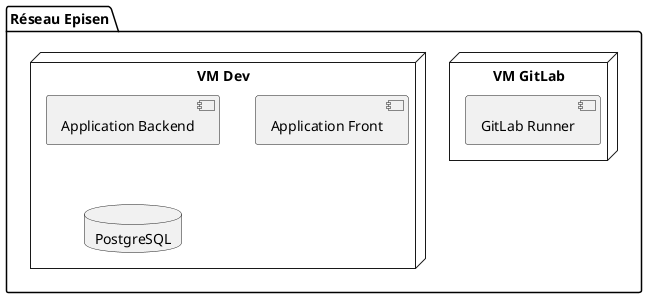
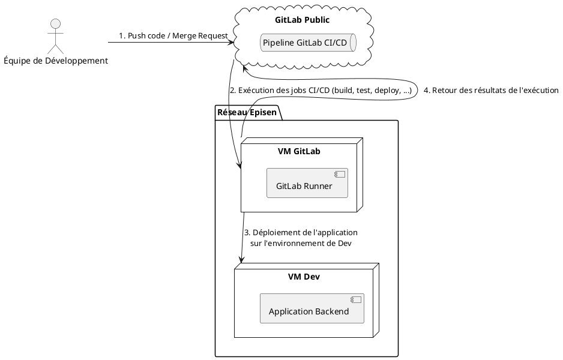

# Documentation d'Architecture Technique

## Description Technique des VMs

### VM GitLab

- **Rôle :** Cette VM héberge le GitLab Runner, qui prend en charge les tâches de CI/CD lancées depuis le pipeline
  GitLab.
- **Composant Clé :**
    - **GitLab Runner :** Le GitLab Runner s’occupe de l’exécution des tâches CI/CD, notamment le build, les tests et le
      déploiement.
- **Paquet logiciel installé :**
    - Java 21
    - Maven
    - Sshpass

### VM Dev

- **Rôle :** VM de développement qui héberge l'application et les données.
- **Composants :**
    - **Application Backend :** L'api rest spring boot.
    - **Application Frontend :** Interface utilisateur fait avec React.
    - **Base de données PostgreSQL :** Stockage des données de l'application.
- **Paquet logiciel installé :**
    - Java 21
    - NodeJS

## Gitlab CI VS Jenkins

Voici un tableau comparatif afin de justifier pourquoi nous avons opté pour **_GitLab CI_**.

| Fonctionnalité                              | GitLab CI                                                                                                       | Jenkins                                                                                                                                      |
|---------------------------------------------|-----------------------------------------------------------------------------------------------------------------|----------------------------------------------------------------------------------------------------------------------------------------------|
| **Intégration avec GitLab**                 | Intégration native, complète avec GitLab (dépôts, gestion de projets, permissions). Facile à configurer.        | Intégration possible via plugins (comme GitLab Plugin), mais nécessite souvent une configuration manuelle.                                   |
| **Configuration des pipelines**             | Pipelines définis dans un fichier `.gitlab-ci.yml` versionné dans le dépôt. Simple à comprendre et à maintenir. | Pipelines définis via Jenkinsfile ou l'interface graphique. Jenkinsfile permet le versionnement, mais l’interface peut être moins intuitive. |
| **Interface utilisateur**                   | Interface moderne et épurée avec une vue claire des pipelines, des jobs, et des logs.                           | Interface personnalisable mais plus complexe. Moins intuitive, peut devenir encombrée avec de nombreux plugins.                              |
| **Facilité de maintenance**                 | Maintenance simplifiée : pas de dépendance excessive aux plugins, les runners sont légers à gérer.              | Exige souvent de nombreux plugins pour les intégrations et les fonctionnalités avancées, ce qui peut augmenter la maintenance.               |
| **Intégration DevOps et gestion de projet** | Intégration fluide avec les fonctionnalités de GitLab (issues, boards, merge requests, métriques DevOps).       | Pas de gestion de projet intégrée, nécessite des outils externes pour les issues et les suivis de projet (comme Jira).                       |
| **Gestion des secrets**                     | Gestion des secrets intégrée avec les variables d'environnement sécurisées accessibles dans `.gitlab-ci.yml`.   | Possibilité de gérer les secrets avec des plugins (ex: plugin "Credentials"), mais ajoute de la complexité.                                  |

## GitLab Continuous Integration / Continuous Delivery (CI/CD)

Ce diagramme montre le processus d'`intégration continu` et de `déploiement continu` **(CI/CD)** dans notre
environnement de développement. Voici les étapes principales :

- **Équipe de Développement:** pousse du code ou soumet une merge request sur GitLab. Cela déclenche l'exécution du
  processus CI/CD via la pipeline GitLab CI/CD.

- **GitLab:** héberge le code et gère les pipelines CI/CD. Lorsqu'un changement est détecté (push ou merge request),
  GitLab déclenche automatiquement l'exécution de la pipeline.

- **La pipeline GitLab:** Gère l'exécution des jobs qui sont décrits dans le fichier `.gitlab-ci.yml` comme le build,
  les tests, et le déploiement.

- **GitLab Runner:** C'est une machine virtuelle dédiée à l'exécution des jobs CI/CD, et ce dernièr reçoit les
  instructions de la pipeline Gitlab à partir du fichier `.gitlab-ci.yml`.

