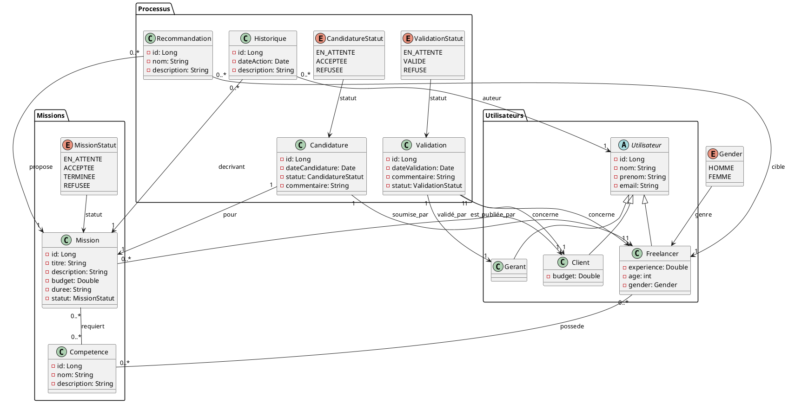

##Diagramme de classe

```plantuml
@startuml

'========================================================
'                 UTILISATEURS
'========================================================
package "Utilisateurs" {
    abstract class Utilisateur {
        - id: Long
        - nom: String
        - prenom: String
        - email: String
    }

    class Client extends Utilisateur {
        - budget: Double
    }

    class Freelancer extends Utilisateur {
        - experience: Double
        - age: int
        - gender: Gender
    }

    class Gerant extends Utilisateur
}

enum Gender {
    HOMME
    FEMME
}

'========================================================
'                 MISSIONS
'========================================================
package "Missions" {
    class Mission {
        - id: Long
        - titre: String
        - description: String
        - budget: Double
        - duree: String
        - statut: MissionStatut
    }

    enum MissionStatut {
        EN_ATTENTE
        ACCEPTEE
        TERMINEE
        REFUSEE
    }

    class Competence {
        - id: Long
        - nom: String
        - description: String
    }
}

'========================================================
'                 PROCESSUS
'========================================================
package "Processus" {
    class Candidature {
        - id: Long
        - dateCandidature: Date
        - statut: CandidatureStatut
        - commentaire: String
    }

    enum CandidatureStatut {
        EN_ATTENTE
        ACCEPTEE
        REFUSEE
    }

    class Validation {
        - id: Long
        - dateValidation: Date
        - commentaire: String
        - statut: ValidationStatut
    }

    enum ValidationStatut {
        EN_ATTENTE
        VALIDE
        REFUSE
    }

    class Historique {
        - id: Long
        - dateAction: Date
        - description: String
    }

    class Recommandation {
        - id: Long
        - nom: String
        - description: String
    }
}

'========================================================
'                 ASSOCIATIONS
'========================================================

'--- Lien direct entre Mission et Client ---
'   1 Client peut publier plusieurs Missions
'   1 Mission est associée à 1 Client
Mission "0..*" --> "1" Client : est_publiée_par

'--- Compétences ---
'   Un Freelancer peut avoir plusieurs Compétences
'   Une Compétence peut être partagée par plusieurs Freelancers
Freelancer "0..*" -- "0..*" Competence : possede

'   Une Mission peut requérir plusieurs Compétences
'   Une Compétence peut être requise par plusieurs Missions
Mission "0..*" -- "0..*" Competence : requiert

'--- Candidature relie un Freelancer à une Mission ---
Candidature "1" --> "1" Freelancer : soumise_par
Candidature "1" --> "1" Mission : pour

'--- Validation relie un Client, un Freelancer et un Gerant ---
Validation "1" --> "1" Client : concerne
Validation "1" --> "1" Freelancer : concerne
Validation "1" --> "1" Gerant : validé_par

'--- Historique associe un Utilisateur et une Mission ---
Historique "0..*" --> "1" Mission : decrivant
Historique "0..*" --> "1" Utilisateur : auteur

'--- Recommandation relie un Freelancer et une Mission ---
Recommandation "0..*" --> "1" Freelancer : cible
Recommandation "0..*" --> "1" Mission : propose

'--- Énumérations utilisées par les classes ---
Gender --> Freelancer : genre
MissionStatut --> Mission : statut
ValidationStatut --> Validation : statut
CandidatureStatut --> Candidature : statut

@enduml

```
