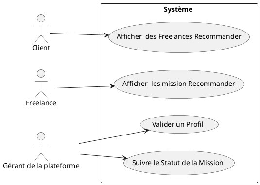
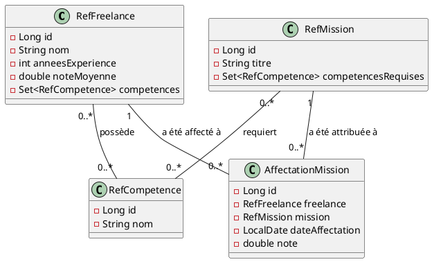

# User Stories pour le Système de Recommandation des Freelances

## User Story 1 : Initialiser le Modèle de Données

**En tant que** développeur,  
**je veux** créer le modèle de données pour les freelances, les missions et ...,  
**afin de** stocker les informations nécessaires pour la recommandation basée sur le filtrage collaboratif.

### Critères d’acceptation :
1. Ajouter les entités suivantes :
    - **Freelance**
    - **Mission**
    - **Competence**
    - **AffectationMission**

2. Les données doivent être stockées dans la base de données PostgreSQL.

## User Story 2 : Développer une API gérant le Système de Recommandation Basé sur le Filtrage Collaboratif

**En tant que** développeur,  
**je veux** créer une api rest qui retourne la liste des freelances recommandés pour une mission,  
**afin de** renvoyer les candidats les plus pertinents en fonction de leur historique de missions similaires et de leurs évaluations passées.

### Critères d’acceptation :
1. Le système de recommandation utilise un **filtrage collaboratif** basé sur les missions similaires :
    - Identifier les missions similaires en fonction des compétences requises.
    - Identifier les freelances qui ont obtenu de bonnes évaluations dans des missions similaires.

2. Pour chaque freelance potentiel, un **score de pertinence** est calculé en combinant :
    - **Correspondance des compétences** : Le nombre de compétences en commun entre la mission et le freelance.
    - **Niveau d’expérience** : Pondéré par les années d’expérience du freelance.
    - **Note moyenne** : Pondérée par la note moyenne obtenue dans les missions similaires.

## User Story 3 : Afficher les Freelances Recommandés sur l'Interface Frontend

**En tant que** client,  
**je veux** voir une liste de freelances recommandés pour mes missions,  
**afin de** pouvoir évaluer les candidats potentiels.

### Critères d’acceptation :
1. Dans la page de chaque mission, afficher les freelances recommandés avec les informations suivantes :
    - Nom du freelance
    - Compétences pertinentes
    - Années d’expérience
    - Note moyenne
    - Score de pertinence calculé par le système

2. Afficher les freelances triés par pertinence, du plus pertinent au moins pertinent.

## Diagramme de UC

## Diagramme de classe metier

